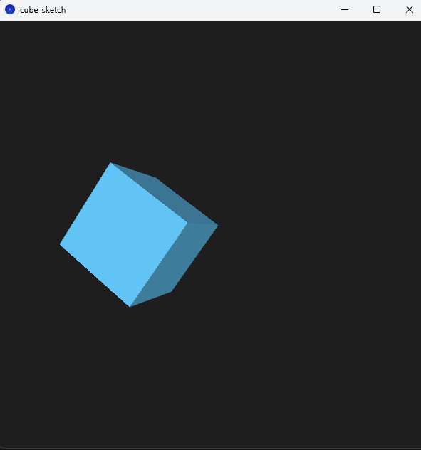

## Estructura del Código

- `setup()`: Configura el entorno de visualización

```pde
void setup() {
  size(600, 600, P3D);
  noStroke();
}
```

- `draw()`: Función principal que se ejecuta continuamente para actualizar la animación
  - Cálculos de tiempo y parámetros de animación
  - Aplicación de transformaciones (traslación, rotación, escala)
  - Renderizado del cubo

```pde
void draw() {
  background(30);
  lights();

  float time = millis() / 1000.0; // Tiempo en segundos

  // Parámetros de animación
  float angle = time;                      // Rotación continua
  float offsetX = sin(time) * 100;         // Movimiento ondulado
  float scaleFactor = 1.0 + 0.5 * sin(time * 2); // Escalado cíclico

  // Centro de la pantalla
  translate(width/2, height/2, 0);

  pushMatrix(); // Aislamos las transformaciones del cubo
    translate(offsetX, 0, 0); // Movimiento horizontal
    rotateY(angle);           // Rotación sobre el eje Y
    rotateX(angle * 0.5);     // Rotación sobre el eje X
    scale(scaleFactor);       // Escalado

    fill(100, 200, 250);
    box(100); // Dibujar cubo
  popMatrix();
}
```
