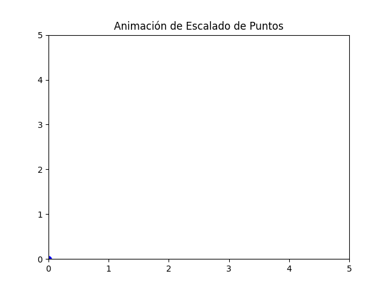

# Transformaciones Geométricas 2D

Este proyecto implementa y visualiza transformaciones geométricas básicas en 2D utilizando matrices de transformación homogéneas. Las transformaciones incluidas son:

- Traslación
- Rotación
- Escalado

## Fundamento Matemático

### Matrices de Transformación Homogénea

Las transformaciones geométricas se implementan utilizando matrices de transformación homogénea, que permiten representar todas las transformaciones de manera uniforme.

#### Traslación

La matriz de traslación mueve un punto $(x, y)$ por un desplazamiento $(t_x, t_y)$:

$$
\begin{bmatrix}
1 & 0 & t_x \\
0 & 1 & t_y \\
0 & 0 & 1 \\
\end{bmatrix}
\cdot
\begin{bmatrix}
x \\
y \\
1 \\
\end{bmatrix}
=
\begin{bmatrix}
x + t_x \\
y + t_y \\
1 \\
\end{bmatrix}
$$

#### Rotación

La matriz de rotación gira un punto alrededor del origen por un ángulo $\theta$:

$$
\begin{bmatrix}
\cos\theta & -\sin\theta & 0 \\
\sin\theta & \cos\theta & 0 \\
0 & 0 & 1 \\
\end{bmatrix}
\cdot
\begin{bmatrix}
x \\
y \\
1 \\
\end{bmatrix}
=
\begin{bmatrix}
x\cos\theta - y\sin\theta \\
x\sin\theta + y\cos\theta \\
1 \\
\end{bmatrix}
$$

#### Escalado

La matriz de escalado cambia el tamaño de un objeto por factores $s_x$ y $s_y$:

$$
\begin{bmatrix}
s_x & 0 & 0 \\
0 & s_y & 0 \\
0 & 0 & 1 \\
\end{bmatrix}
\cdot
\begin{bmatrix}
x \\
y \\
1 \\
\end{bmatrix}
=
\begin{bmatrix}
s_x \cdot x \\
s_y \cdot y \\
1 \\
\end{bmatrix}
$$

## Explicación del código

El código de este proyecto tiene dos componentes principales:

- Clase Animation
- Funciones de animación (Traslacion, Rotación y Escalado)

La clase Animation provee un entorno para ejecutar animaciones sobre un plot de matplotlib, y acepta una función callback para generar los puntos a renderizar en cada frame.

## Clase Animation

La clase `Animation` proporciona una estructura para crear animaciones de transformaciones geométricas. Sus características principales son:

- Gestión de fotogramas para crear animaciones fluidas
- Aplicación de transformaciones incrementales
- Visualización de la transformación en tiempo real
- Exportación de animaciones como GIF

```py
class Animation:
    def __init__(self, xlim=(0, 10), ylim=(0, 10), frames=30, interval=1000, gif_filename='animation.gif',
                 update_callback=None, title=None, info_text=None):
        self.xlim = xlim
        self.ylim = ylim
        self.frames = frames
        self.interval = interval
        self.gif_filename = gif_filename
        self.update_callback = update_callback  # Callback para generar puntos
        self.title = title  # Título de la animación
        self.info_text = info_text  # Texto informativo

        # Crear figura y eje
        self.fig, self.ax = plt.subplots()
        self.ax.set_xlim(*self.xlim)
        self.ax.set_ylim(*self.ylim)

        # Agregar título si se proporciona
        if self.title:
            self.ax.set_title(self.title)

        # Inicializar puntos
        self.points, = self.ax.plot([], [], 'bo-')  # 'bo' para puntos azules

        # Agregar texto informativo si se proporciona
        if self.info_text:
            self.text = self.ax.text(0.5, -0.1, self.info_text, ha='center', va='center', transform=self.ax.transAxes)
        else:
            self.text = None

    def init(self):
        """Función para inicializar la animación."""
        self.points.set_data([], [])
        return self.points,

    def update(self, frame):
        """Función para actualizar los datos en cada cuadro."""
        x, y = self.update_callback(frame, self.xlim, self.ylim)
        self.points.set_data(x, y)
        return self.points,

    def create_animation(self):
        """Crear la animación."""
        self.ani = FuncAnimation(
            self.fig, self.update, init_func=self.init,
            frames=self.frames, interval=self.interval, blit=True
        )

    def save_animation(self):
        """Guardar la animación como un GIF."""
        self.ani.save(self.gif_filename, writer='pillow')

    def render_gif(self):
        """Renderizar el GIF en el notebook."""
        return Image(filename=self.gif_filename)
```

## Animaciones Implementadas

### Traslación


La animación de traslación muestra cómo un objeto se desplaza desde una posición inicial hasta una posición final. La transformación se aplica incrementalmente para crear un movimiento suave.

```py
def MOVE_POINTS_ANIMATION(frame, xlim, ylim):
    points = np.array([[0, 0], [1, 0], [0.5, 1], [0, 0]])  # Triángulo inicial

    # Factores de traslación
    tx, ty = 0.1, 0.1  # Incremento del 10% por frame
    MATRIZ_TRASLACION = np.array([
        [1, 0, tx * frame],
        [0, 1, ty * frame],
        [0, 0, 1         ]
    ])

    # Aplicar la traslación a los puntos
    traslated_points = []
    for point in points:
        point_homogeneo = np.append(point, 1)
        point_trasladado = MATRIZ_TRASLACION @ point_homogeneo
        traslated_points.append(point_trasladado[:2])

    traslated_points = np.array(traslated_points)
    return traslated_points[:, 0], traslated_points[:, 1]
```

### Rotación


La animación de rotación muestra cómo un objeto gira alrededor de un punto (generalmente el origen). El ángulo de rotación se incrementa gradualmente para crear el efecto de rotación continua.

```py
def ROTATE_POINTS_ANIMATION(frame, xlim, ylim):
    points = np.array([[2, 2], [3, 2], [2.5, 3], [2, 2]])  # Triángulo inicial

    # Factores de escalado
    theta = np.radians(15)  # 15 grados por frame
    MATRIZ_ROTACION = np.array([
        [cos(theta * frame), -sin(theta * frame) , 0],
        [sin(theta * frame), cos(theta * frame) , 0],
        [0, 0, 1]
    ])

    # Aplicar la traslación a los puntos
    scaled_points = []
    for point in points:
        point_homogeneo = np.append(point, 1)
        point_escalado = MATRIZ_ROTACION @ point_homogeneo
        scaled_points.append(point_escalado[:2])

    scaled_points = np.array(scaled_points)
    return scaled_points[:, 0], scaled_points[:, 1]
```

### Escalado



La animación de escalado muestra cómo un objeto cambia de tamaño. Los factores de escala se modifican progresivamente para crear un efecto de crecimiento o reducción suave.

```py
def SCALE_POINTS_ANIMATION(frame, xlim, ylim):
    points = np.array([[1, 1], [2, 1], [1.5, 2], [1, 1]])  # Triángulo inicial

    # Factores de escalado
    sx, sy = 0.05, 0.05 # Incremento del 5% por frame
    MATRIZ_ESCALADO = np.array([
        [sx * frame, 0, 0],
        [0, sy * frame, 0],
        [0, 0, 1]
    ])

    # Aplicar la traslación a los puntos
    scaled_points = []
    for point in points:
        point_homogeneo = np.append(point, 1)
        point_escalado = MATRIZ_ESCALADO @ point_homogeneo
        scaled_points.append(point_escalado[:2])

    scaled_points = np.array(scaled_points)
    return scaled_points[:, 0], scaled_points[:, 1]
```
