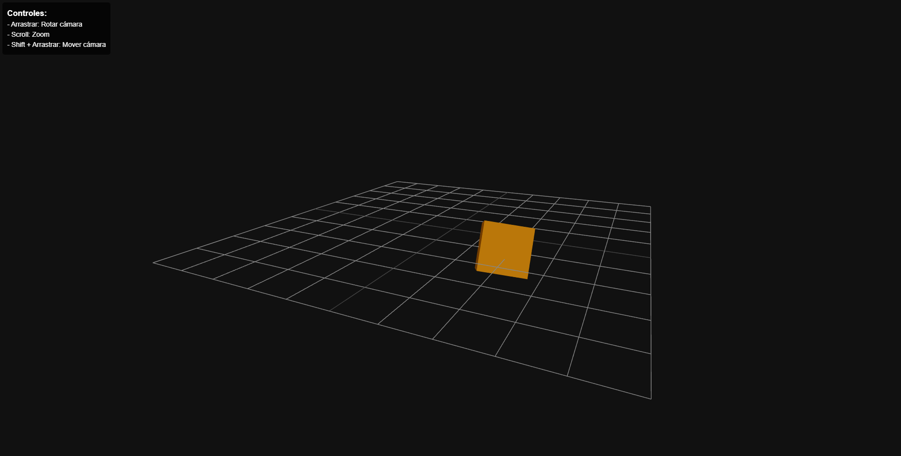

# Animaciones 3D con Three.js y React

Este proyecto demuestra el uso de Three.js con React para crear una escena 3D interactiva con objetos animados utilizando transformaciones geométricas.

## Demo



La aplicación muestra un cubo con diferentes tipos de transformaciones:

- Traslación en una trayectoria circular en el plano XZ
- Rotación sobre sus propios ejes
- Escalado dinámico usando funciones temporales

## Implementación de las transformaciones

#### Traslación

```javascript
// Trayectoria circular (Cubo)
meshRef.current.position.x = position[0] + Math.sin(time) * 2;
meshRef.current.position.z = position[2] + Math.cos(time) * 2;
```

#### Rotación

```javascript
// Rotación del Cubo
meshRef.current.rotation.x += 0.01;
meshRef.current.rotation.y += 0.01;
```

#### Escalado

```javascript
// Escalado del Cubo
const scale = 1 + 0.2 * Math.sin(time * 2);
meshRef.current.scale.set(scale, scale, scale);
```

## Estructura del proyecto

- `src/App.jsx`: Componente principal que contiene la escena 3D y los objetos animados
- `src/App.css`: Estilos CSS para la aplicación
- `index.html`: Página HTML principal
