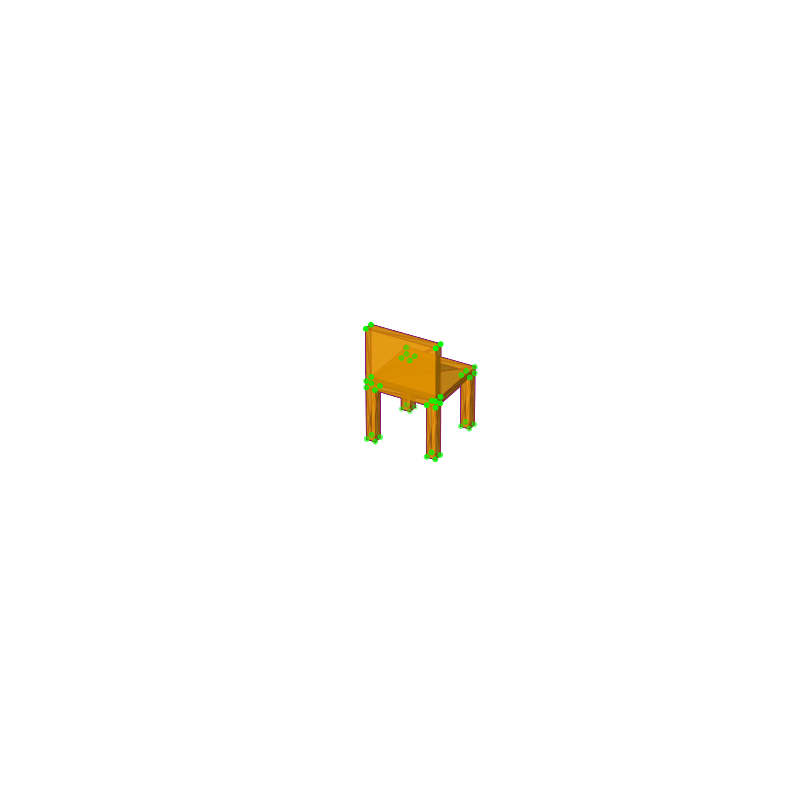
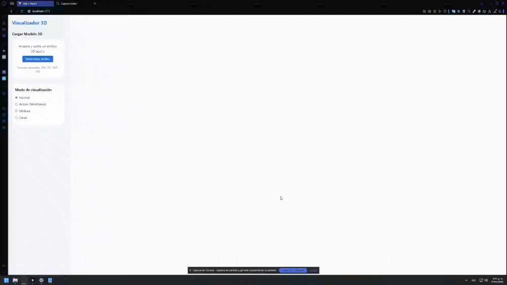

# 🧪 Taller Estructuras 3D

## 📅 Fecha
`2025-04-27`

---

## 🎯 Objetivo del Taller

Crear un visualizador 3D interactivo utilizando tanto Python como Three.js que permita cargar modelos en diferentes formatos (OBJ, STL, GLTF), visualizarlos con diferentes modos de representación (normal, wireframe, vértices, caras) y mostrar información técnica sobre el modelo.

---

## 🧠 Conceptos Aprendidos

Lista los principales conceptos aplicados:

- [x] Transformaciones geométricas (escala, rotación, traslación)
- [ ] Segmentación de imágenes
- [x] Visualización y renderizado 3D
- [x] Shaders y efectos visuales
- [ ] Entrenamiento de modelos IA
- [ ] Comunicación por gestos o voz
- [x] Otro: Manipulación de mallas y geometrías 3D, cálculo de propiedades geométricas

---

## 🔧 Herramientas y Entornos

Especifica los entornos usados:

### Python
- Bibliotecas de procesamiento 3D
  - trimesh
  - vedo
  - numpy
  - matplotlib
  - IPython

### JavaScript
- Three.js / React Three Fiber
  - React v19.0.0
  - Three.js
  - @react-three/fiber
  - @react-three/drei

---
## 🧪 Implementación

Explica el proceso:

### 🔹 Etapas realizadas en Python
1. Configuración del entorno Python con las bibliotecas necesarias (trimesh, vedo, matplotlib).
2. Implementación de la clase `Visualizador3D` para cargar modelos 3D (soporte para OBJ, STL, GLTF, GLB).
3. Desarrollo de métodos para mostrar información estructural del modelo.
4. Implementación de visualización interactiva usando vedo para mostrar vértices, aristas y caras.
5. Creación de método para generar animaciones rotando el modelo y exportarlas como GIF.

### 🔹 Etapas realizadas en Three.js
1. Configuración del entorno React con Three.js y React Three Fiber.
2. Implementación del componente de carga de archivos 3D (soporte para OBJ, STL, GLTF, GLB).
3. Desarrollo del visualizador 3D con controles orbitales y modos de visualización.
4. Creación del componente de información que muestra datos técnicos del modelo.
5. Implementación de la interfaz de usuario para interactuar con el visualizador.

### 🔹 Código relevante en Python

```python
def visualizar_con_vedo(self):
    """Visualiza el modelo con vedo, mostrando vértices, aristas y caras"""
    # Creamos una escena
    plt = vedo.Plotter(title=f"Modelo: {os.path.basename(self.ruta_modelo)}")
    
    # Preparamos las representaciones visuales con colores distintos
    vertices = vedo.Points(self.mesh_vedo.points, r=8, c="magenta")
    aristas = self.mesh_vedo.wireframe().color("cyan")
    caras = self.mesh_vedo.clone().color("yellow").alpha(0.7)
    
    # Añadimos las representaciones a la escena
    plt.add(vertices, "Vértices")
    plt.add(aristas, "Aristas")
    plt.add(caras, "Caras")
    
    # Mostramos la escena
    plt.show()
```

### 🔹 Código relevante en Three.js

```jsx
// Implementación de modos de visualización
switch (currentMode) {
  case 'normal':
    child.material = new THREE.MeshStandardMaterial({
      color: 0xaaaaaa,
      metalness: 0.25,
      roughness: 0.6,
      side: THREE.DoubleSide
    })
    break
    
  case 'wireframe':
    child.material = new THREE.MeshBasicMaterial({
      color: 0x00ff00,
      wireframe: true,
      side: THREE.DoubleSide
    })
    break
    
  case 'vertices':
    // Crear visualización de vértices
    if (child.geometry) {
      const pointsGeometry = new THREE.BufferGeometry()
      pointsGeometry.setAttribute('position', 
        child.geometry.attributes.position.clone())
      
      const pointsMaterial = new THREE.PointsMaterial({
        color: 0xff0000,
        size: 0.03,
        sizeAttenuation: true
      })
      
      const points = new THREE.Points(pointsGeometry, pointsMaterial)
      // Aplicar transformaciones
      child.updateWorldMatrix(true, false)
      points.applyMatrix4(child.matrixWorld)
      // Añadir puntos a la escena
      pointsRef.current = points
      scene.add(points)
    }
    break
}
```

---

## 📊 Resultados Visuales

### Versión Python


> Nota: El GIF muestra la animación generada de un modelo de silla rotando, donde se visualizan los vértices, aristas y caras del modelo con diferentes colores.

### Versión Three.js


> Nota: El GIF muestra la aplicación funcionando con los diferentes modos de visualización (normal, wireframe, vértices y caras).

---

## 🧩 Prompts Usados

### Python
```text
"Crea un código en Python que haga lo siguiente: 
- Cargar un modelo 3D en formato .OBJ, .STL o .GLTF usando trimesh y vedo.
- Extraer y mostrar información estructural del modelo (vértices, caras, volumen).
- Visualizar el modelo mostrando sus vértices, aristas y caras con diferentes colores.
- Generar una animación que muestre el modelo rotando y guardarla como GIF."
```

### Three.js
```text
"Crea un código en javascript usando Node y ThreeJS que haga lo siguiente: 
- Cargar un modelo 3D en formato .OBJ, .STL o .GLTF usando @react-three/drei. (El usuario debería poder subir el archivo desde su PC usando la UI de la app)
- Visualizar el modelo con OrbitControls.
- Resaltar vértices, aristas o caras usando efectos visuales como líneas (Edges, Wireframe) o puntos (Points).
- Crear una pequeña interfaz para cambiar entre visualización de vértices/aristas/caras y mostrar información básica del modelo (número de vértices, etc."
```

---

## 💬 Reflexión Final

Este taller me permitió profundizar en el funcionamiento interno de las estructuras 3D y cómo se representan computacionalmente utilizando tanto Python como JavaScript/Three.js. Aprendí sobre los diferentes componentes que conforman un modelo 3D (vértices, aristas, caras) y cómo manipularlos a través de bibliotecas especializadas.

### Desafíos en Python
La parte más desafiante fue implementar la animación de rotación con matplotlib, que requirió entender cómo funcionan las matrices de transformación para rotar correctamente el modelo en 3D. También fue complejo conseguir una representación visual clara donde se pudieran apreciar simultáneamente los vértices, aristas y caras del modelo.

### Desafíos en Three.js
La parte más desafiante fue implementar la visualización correcta de los diferentes modos, especialmente el modo de vértices, que requirió entender cómo funcionan las matrices de transformación en Three.js para asegurar que los puntos se posicionaran correctamente en el espacio 3D. También fue complejo manejar eficientemente los recursos para evitar fugas de memoria al cargar y cambiar entre modelos.

### Proyectos futuros
En futuros proyectos, me gustaría expandir esta aplicación para incluir:
- Análisis más avanzados de las mallas 3D (detección de colisiones, cálculo de secciones transversales)
- Simulaciones físicas
- Capacidades de edición de modelos
- Soporte para más formatos de archivos
- Una interfaz gráfica más completa e intuitiva que permita interactuar con el modelo

## ✅ Checklist de Entrega

- [x] Carpeta `2025-04-27__taller_estructuras_3d`
- [x] Código limpio y funcional en Python y Three.js
- [x] GIFs incluidos con nombres descriptivos
- [x] Visualizaciones exportadas
- [x] README completo y claro
- [x] Commits descriptivos en inglés

---
