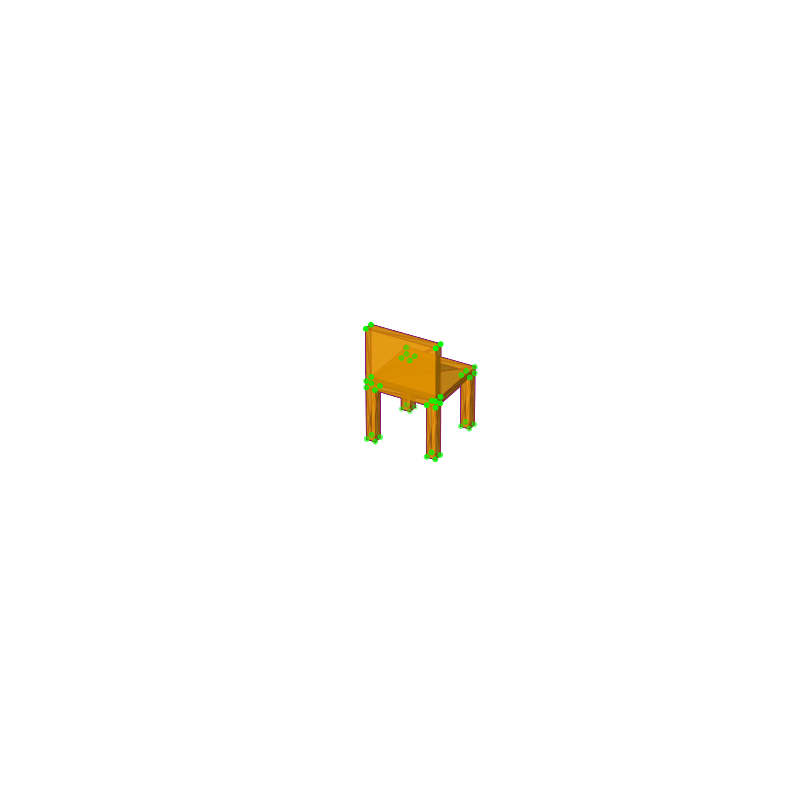

# 🧪 Taller Estructuras 3D

## 📅 Fecha
`2025-04-27`

---

## 🎯 Objetivo del Taller

Crear un visualizador 3D interactivo utilizando Python que permita cargar modelos en diferentes formatos (OBJ, STL, GLTF), visualizarlos con diferentes modos de representación (normal, wireframe, vértices, caras) y mostrar información técnica sobre el modelo.

---

## 🧠 Conceptos Aprendidos

Lista los principales conceptos aplicados:

- [x] Transformaciones geométricas (escala, rotación, traslación)
- [ ] Segmentación de imágenes
- [x] Visualización y renderizado 3D
- [ ] Entrenamiento de modelos IA
- [ ] Comunicación por gestos o voz
- [x] Otro: Manipulación de mallas 3D, cálculo de propiedades geométricas

---

## 🔧 Herramientas y Entornos

Especifica los entornos usados:

- Python y bibliotecas de procesamiento 3D
  - trimesh
  - vedo
  - numpy
  - matplotlib
  - IPython

---
## 🧪 Implementación

Explica el proceso:

### 🔹 Etapas realizadas
1. Configuración del entorno Python con las bibliotecas necesarias (trimesh, vedo, matplotlib).
2. Implementación de la clase `Visualizador3D` para cargar modelos 3D (soporte para OBJ, STL, GLTF, GLB).
3. Desarrollo de métodos para mostrar información estructural del modelo.
4. Implementación de visualización interactiva usando vedo para mostrar vértices, aristas y caras.
5. Creación de método para generar animaciones rotando el modelo y exportarlas como GIF.

### 🔹 Código relevante

Código para cargar y visualizar modelos 3D:

```python
def visualizar_con_vedo(self):
    """Visualiza el modelo con vedo, mostrando vértices, aristas y caras"""
    # Creamos una escena
    plt = vedo.Plotter(title=f"Modelo: {os.path.basename(self.ruta_modelo)}")
    
    # Preparamos las representaciones visuales con colores distintos
    vertices = vedo.Points(self.mesh_vedo.points, r=8, c="magenta")
    aristas = self.mesh_vedo.wireframe().color("cyan")
    caras = self.mesh_vedo.clone().color("yellow").alpha(0.7)
    
    # Añadimos las representaciones a la escena
    plt.add(vertices, "Vértices")
    plt.add(aristas, "Aristas")
    plt.add(caras, "Caras")
    
    # Mostramos la escena
    plt.show()
```

---

## 📊 Resultados Visuales



> Nota: El GIF muestra la animación generada de un modelo de silla rotando, donde se visualizan los vértices, aristas y caras del modelo con diferentes colores.

---

## 🧩 Prompts Usados

Enumera los prompts utilizados:

```text
"Crea un código en Python que haga lo siguiente: 
- Cargar un modelo 3D en formato .OBJ, .STL o .GLTF usando trimesh y vedo.
- Extraer y mostrar información estructural del modelo (vértices, caras, volumen).
- Visualizar el modelo mostrando sus vértices, aristas y caras con diferentes colores.
- Generar una animación que muestre el modelo rotando y guardarla como GIF."
```

---

## 💬 Reflexión Final

Este taller me permitió profundizar en el funcionamiento interno de las estructuras 3D y cómo se representan computacionalmente utilizando Python. Aprendí sobre los diferentes componentes que conforman un modelo 3D (vértices, aristas, caras) y cómo manipularlos a través de bibliotecas especializadas como trimesh y vedo.

La parte más desafiante fue implementar la animación de rotación con matplotlib, que requirió entender cómo funcionan las matrices de transformación para rotar correctamente el modelo en 3D. También fue complejo conseguir una representación visual clara donde se pudieran apreciar simultáneamente los vértices, aristas y caras del modelo.

En futuros proyectos, me gustaría expandir esta aplicación para incluir análisis más avanzados de las mallas 3D, como detección de colisiones, cálculo de secciones transversales o simulaciones físicas. También sería interesante implementar una interfaz gráfica más completa que permita interactuar con el modelo de forma más intuitiva.

## ✅ Checklist de Entrega

- [x] Carpeta `2025-04-27__taller_estructuras_3d`
- [x] Código limpio y funcional
- [x] GIF incluido con nombre descriptivo
- [x] Visualizaciones exportadas
- [x] README completo y claro
- [x] Commits descriptivos en inglés

---
