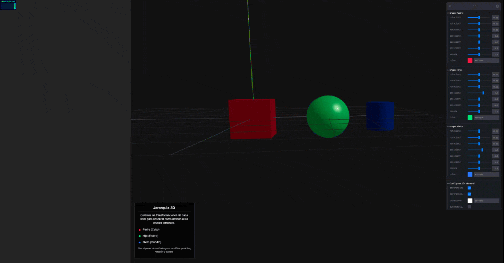

# 🧪 Taller de Jerarquías y Transformaciones

## 📅 Fecha
`2025-04-27`

---

## 🎯 Objetivo del Taller

Explorar y comprender el funcionamiento de las jerarquías de transformaciones 3D, implementando un sistema interactivo donde el usuario pueda manipular posición, rotación y escala de objetos organizados jerárquicamente.

---

## 🧠 Conceptos Aprendidos

Lista los principales conceptos aplicados:

- [x] Transformaciones geométricas (escala, rotación, traslación)
- [ ] Segmentación de imágenes
- [x] Shaders y efectos visuales
- [ ] Entrenamiento de modelos IA
- [ ] Comunicación por gestos o voz
- [x] Otro: _Jerarquías de objetos 3D_

---

## 🔧 Herramientas y Entornos

Especifica los entornos usados:

- Three.js / React Three Fiber
- Vite
- Leva (para controles interactivos)
- React


---

## 🧪 Implementación

Explica el proceso:

### 🔹 Etapas realizadas
1. Configuración del entorno Three.js con React Three Fiber y Vite.
2. Implementación de la jerarquía de objetos 3D con tres niveles: padre, hijo y nieto.
3. Integración de controles interactivos usando Leva para manipular transformaciones.
4. Visualización de conectores entre objetos para representar la relación jerárquica.
5. Implementación de funcionalidad de autorotación para demostrar la herencia de transformaciones.

### 🔹 Código relevante

```jsx
import { Canvas, useFrame } from '@react-three/fiber'
import { OrbitControls, Stats } from '@react-three/drei'
import { Leva, useControls, LevaPanel, button } from 'leva'
import * as THREE from 'three'
import { useState, useRef } from 'react'
import './App.css'

// Opciones para personalizar la apariencia de Leva
const levaTheme = {
  colors: {
    accent1: '#2979ff',
    accent2: '#007aff',
    accent3: '#007aff',
    highlight1: '#535bf2',
    highlight2: '#535bf2',
    highlight3: '#535bf2',
    vivid1: '#ffcc00'
  }
}

const levaConfig = {
  theme: levaTheme,
  titleBar: { title: "Control de Jerarquías" },
  fill: true,
  flat: true,
  hideCopyButton: true
}

function ConectorLinea({ inicio = [0, 0, 0], fin = [1, 0, 0], color = "white" }) {
  const points = [
    new THREE.Vector3(...inicio),
    new THREE.Vector3(...fin)
  ]
  
  const lineGeometry = new THREE.BufferGeometry().setFromPoints(points)
  
  return (
    <line geometry={lineGeometry}>
      <lineBasicMaterial color={color} />
    </line>
  )
}

function Jerarquia() {
  const padreRef = useRef()
  const hijoRef = useRef()
  const nietoRef = useRef()

  const [autoRotate, setAutoRotate] = useState(false)

  // Controles para el grupo padre
  const padreControls = useControls('Grupo Padre', {
    rotacionX: { value: 0, min: -Math.PI, max: Math.PI, step: 0.01 },
    rotacionY: { value: 0, min: -Math.PI, max: Math.PI, step: 0.01 },
    rotacionZ: { value: 0, min: -Math.PI, max: Math.PI, step: 0.01 },
    posicionX: { value: 0, min: -5, max: 5, step: 0.1 },
    posicionY: { value: 0, min: -5, max: 5, step: 0.1 },
    posicionZ: { value: 0, min: -5, max: 5, step: 0.1 },
    escala: { value: 1, min: 0.5, max: 1.5, step: 0.1 },
    color: { value: "#ff1744" }
  })

  // Controles para el grupo hijo
  const hijoControls = useControls('Grupo Hijo', {
    rotacionX: { value: 0, min: -Math.PI, max: Math.PI, step: 0.01 },
    rotacionY: { value: 0, min: -Math.PI, max: Math.PI, step: 0.01 },
    rotacionZ: { value: 0, min: -Math.PI, max: Math.PI, step: 0.01 },
    posicionX: { value: 2, min: -5, max: 5, step: 0.1 },
    posicionY: { value: 0, min: -5, max: 5, step: 0.1 },
    posicionZ: { value: 0, min: -5, max: 5, step: 0.1 },
    escala: { value: 1, min: 0.5, max: 1.5, step: 0.1 },
    color: { value: "#00e676" }
  })

  // Controles para el grupo nieto
  const nietoControls = useControls('Grupo Nieto', {
    rotacionX: { value: 0, min: -Math.PI, max: Math.PI, step: 0.01 },
    rotacionY: { value: 0, min: -Math.PI, max: Math.PI, step: 0.01 },
    rotacionZ: { value: 0, min: -Math.PI, max: Math.PI, step: 0.01 },
    posicionX: { value: 1.5, min: -5, max: 5, step: 0.1 },
    posicionY: { value: 0, min: -5, max: 5, step: 0.1 },
    posicionZ: { value: 0, min: -5, max: 5, step: 0.1 },
    escala: { value: 1, min: 0.5, max: 1.5, step: 0.1 },
    color: { value: "#2979ff" }
  })

  // Controles generales
  const generalControls = useControls('Configuración General', {
    mostrarEjes: { value: true },
    mostrarConectores: { value: true },
    colorConectores: { value: "#ffffff" },
    autoRotacion: { 
      value: false,
      onChange: (v) => setAutoRotate(v)
    }
  })

  useFrame((state, delta) => {
    if (autoRotate) {
      if (padreRef.current) {
        padreRef.current.rotation.y += delta * 0.2
      }
      if (hijoRef.current) {
        hijoRef.current.rotation.x += delta * 0.3
      }
      if (nietoRef.current) {
        nietoRef.current.rotation.z += delta * 0.5
      }
    }
  })

  return (
    <>
      {/* Grupo Padre */}
      <group 
        ref={padreRef}
        position={[padreControls.posicionX, padreControls.posicionY, padreControls.posicionZ]} 
        rotation={[padreControls.rotacionX, padreControls.rotacionY, padreControls.rotacionZ]}
        scale={padreControls.escala}
      >
        {/* Objeto del padre */}
        <mesh>
          <boxGeometry args={[1, 1, 1]} />
          <meshStandardMaterial color={padreControls.color} metalness={0.5} roughness={0.2} />
        </mesh>

        {/* Línea que conecta el padre con el hijo */}
        {generalControls.mostrarConectores && (
          <ConectorLinea 
            inicio={[0, 0, 0]} 
            fin={[hijoControls.posicionX, hijoControls.posicionY, hijoControls.posicionZ]} 
            color={generalControls.colorConectores}
          />
        )}

        {/* Grupo Hijo */}
        <group 
          ref={hijoRef}
          position={[hijoControls.posicionX, hijoControls.posicionY, hijoControls.posicionZ]} 
          rotation={[hijoControls.rotacionX, hijoControls.rotacionY, hijoControls.rotacionZ]}
          scale={hijoControls.escala}
        >
          {/* Objeto del hijo */}
          <mesh>
            <sphereGeometry args={[0.6, 32, 32]} />
            <meshStandardMaterial color={hijoControls.color} metalness={0.3} roughness={0.4} />
          </mesh>

          {/* Línea que conecta el hijo con el nieto */}
          {generalControls.mostrarConectores && (
            <ConectorLinea 
              inicio={[0, 0, 0]} 
              fin={[nietoControls.posicionX, nietoControls.posicionY, nietoControls.posicionZ]} 
              color={generalControls.colorConectores}
            />
          )}

          {/* Grupo Nieto (tercer nivel) */}
          <group 
            ref={nietoRef}
            position={[nietoControls.posicionX, nietoControls.posicionY, nietoControls.posicionZ]} 
            rotation={[nietoControls.rotacionX, nietoControls.rotacionY, nietoControls.rotacionZ]}
            scale={nietoControls.escala}
          >
            {/* Objeto del nieto */}
            <mesh>
              <cylinderGeometry args={[0.4, 0.4, 0.8, 32]} />
              <meshStandardMaterial color={nietoControls.color} metalness={0.7} roughness={0.1} />
            </mesh>
          </group>
        </group>
      </group>

      {/* Ejes de coordenadas condicionales */}
      {generalControls.mostrarEjes && <axesHelper args={[5]} />}
    </>
  )
}

function App() {
  return (
    <div className="app-container">
      <LevaPanel {...levaConfig} />
      <Canvas camera={{ position: [5, 5, 5], fov: 45 }}>
        <color attach="background" args={['#111']} />
        <ambientLight intensity={0.5} />
        <directionalLight position={[10, 10, 5]} intensity={1} castShadow />
        <Jerarquia />
        <OrbitControls />
        <Stats />
        <gridHelper args={[10, 10, '#444', '#222']} />
      </Canvas>
      <div className="info-overlay">
        <h3>Jerarquía 3D</h3>
        <p>Controla las transformaciones de cada nivel para observar cómo afectan a los niveles inferiores.</p>
        <ul>
          <li><span style={{ color: '#ff1744' }}>■</span> Padre (Cubo)</li>
          <li><span style={{ color: '#00e676' }}>■</span> Hijo (Esfera)</li>
          <li><span style={{ color: '#2979ff' }}>■</span> Nieto (Cilindro)</li>
        </ul>
        <p className="tip">Usa el panel de controles para modificar posición, rotación y escala.</p>
      </div>
    </div>
  )
}

export default App

```

---

## 📊 Resultados Visuales




---

## 🧩 Prompts Usados

```
Escribe un código en NodeJS con Vite y React Three Fiber que haga lo siguiente:

- Crear una estructura padre-hijo usando <group> y varios objetos (<mesh>).
Aplicar transformaciones al nodo padre (rotación y traslación) y observar el comportamiento de los hijos.
- Usar dat.GUI o leva para controlar la rotación y traslación en tiempo real con sliders.
- Agregar un tercer nivel en la jerarquía para visualizar transformaciones encadenadas.
```

---

## 💬 Reflexión Final

Este taller fue una experiencia enriquecedora para comprender en profundidad cómo funcionan las jerarquías de transformaciones en entornos 3D. Aprendí que cuando aplicamos transformaciones a un objeto padre, estas se propagan a todos sus hijos y nietos, creando un sistema de coordenadas relativos que facilita la creación de estructuras complejas.

La parte más interesante fue implementar los controles interactivos con Leva, permitiendo ajustar cada propiedad en tiempo real y visualizar inmediatamente cómo afectan los cambios a toda la estructura. Particularmente desafiante fue la implementación de los conectores dinámicos entre objetos, que se actualizan con cada transformación.

Para futuros proyectos, aplicaría estos conceptos de jerarquía para crear animaciones más complejas, como personajes articulados o sistemas mecánicos. También mejoraría la interfaz de usuario para hacerla más intuitiva, quizás añadiendo presets de animaciones o controles más visuales como gizmos directamente en la escena 3D.


---

## ✅ Checklist de Entrega

- [x] Carpeta `2025-04-27_taller_jerarquias_transformaciones`
- [x] Código limpio y funcional
- [x] GIF incluido con nombre descriptivo
- [x] Visualizaciones exportadas
- [x] README completo y claro
- [x] Commits descriptivos en inglés

---