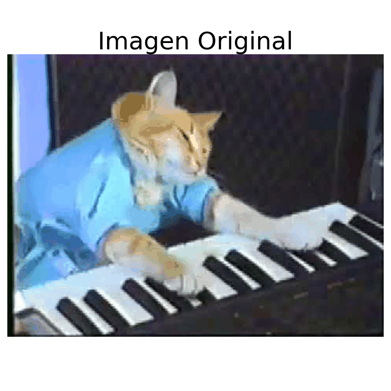

# 🧪 Taller de Ojos Digitales

## 📅 Fecha
`2025-04-27`

---

## 🎯 Objetivo del Taller

Explorar técnicas de procesamiento de imágenes digitales utilizando filtros convolucionales y métodos de detección de bordes para simular cómo los "ojos digitales" (sistemas de visión por computadora) pueden percibir y destacar características de imágenes.

---

## 🧠 Conceptos Aprendidos

Lista los principales conceptos aplicados:

- [x] Transformaciones geométricas (escala, rotación, traslación)
- [x] Segmentación de imágenes
- [ ] Shaders y efectos visuales
- [ ] Entrenamiento de modelos IA
- [ ] Comunicación por gestos o voz
- [x] Otro: Filtros convolucionales y detección de bordes

---

## 🔧 Herramientas y Entornos

Especifica los entornos usados:

- Python (`opencv-python`, `numpy`, `matplotlib`)
- Jupyter Notebook

---

## 🧪 Implementación

Explica el proceso:

### 🔹 Etapas realizadas
1. Carga de imagen y conversión a escala de grises.
2. Aplicación de filtros convolucionales (desenfoque y nitidez).
3. Implementación de diferentes métodos de detección de bordes (Sobel, Laplaciano, Canny).
4. Visualización comparativa de los resultados.

### 🔹 Código relevante

Incluye un fragmento que resuma el corazón del taller:

```python
# Convertir a escala de grises
gris = cv2.cvtColor(imagen, cv2.COLOR_BGR2GRAY)

# Aplicar filtros convolucionales
blur = cv2.GaussianBlur(gris, (5, 5), 0)

kernel_sharpening = np.array([[-1, -1, -1],
                                [-1,  9, -1],
                                [-1, -1, -1]])
sharpened = cv2.filter2D(gris, -1, kernel_sharpening)

sobelx = cv2.Sobel(gris, cv2.CV_64F, 1, 0, ksize=3)
sobelx = cv2.convertScaleAbs(sobelx)

sobely = cv2.Sobel(gris, cv2.CV_64F, 0, 1, ksize=3)
sobely = cv2.convertScaleAbs(sobely)

sobel_combinado = cv2.addWeighted(sobelx, 0.5, sobely, 0.5, 0)

laplaciano = cv2.Laplacian(gris, cv2.CV_64F)
laplaciano = cv2.convertScaleAbs(laplaciano)

canny = cv2.Canny(gris, 100, 200)
```

---

## 📊 Resultados Visuales



---

## 🧩 Prompts Usados

Enumera los prompts utilizados:

```text
Crea un código en Python usando las herramientas: opencv-python, numpy, matplotlib que haga lo siguiente:

- Cargar una imagen a color y convertirla a escala de grises.
- Aplicar filtros convolucionales simples (blur, sharpening).
- Implementar detección de bordes utilizando:
    * Filtro de Sobel en X y Y.
    * Filtro Laplaciano.
    * Comparación visual entre métodos.
- Visualizar cada resultado con cv2.imshow() o matplotlib.pyplot.imshow().
```

---

## 💬 Reflexión Final

Este taller permitió comprender cómo funcionan los diferentes métodos de procesamiento de imágenes digitales, especialmente en relación a la detección de bordes y aplicación de filtros, simulando las capacidades de los sistemas de visión artificial.

Los filtros de Sobel y Laplaciano mostraron características diferentes al resaltar bordes, siendo Sobel más sensible a cambios direccionales mientras que Laplaciano detecta cambios de intensidad en todas direcciones. El algoritmo Canny resultó especialmente efectivo al proporcionar bordes más definidos y con menos ruido.

Estos conceptos son fundamentales para aplicaciones de visión por computadora como reconocimiento de objetos, seguimiento de movimiento y segmentación de imágenes, constituyendo la base de sistemas más complejos de percepción visual artificial.

---

## ✅ Checklist de Entrega

- [x] Carpeta `2025-04-27__taller_ojos_digitales`
- [x] Código limpio y funcional
- [x] Visualizaciones exportadas
- [x] README completo y claro
- [x] Commits descriptivos en inglés

---