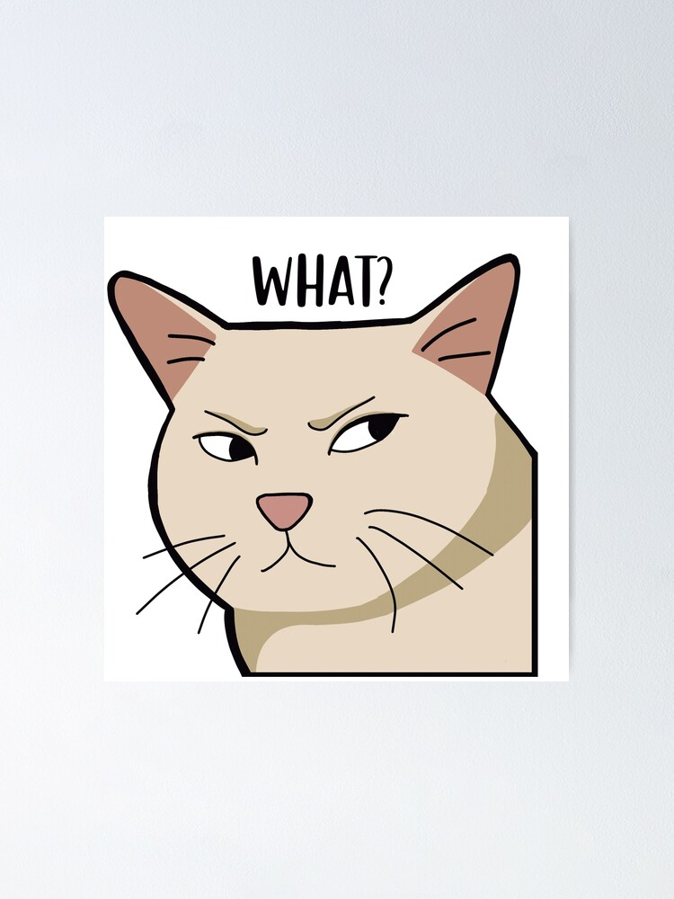
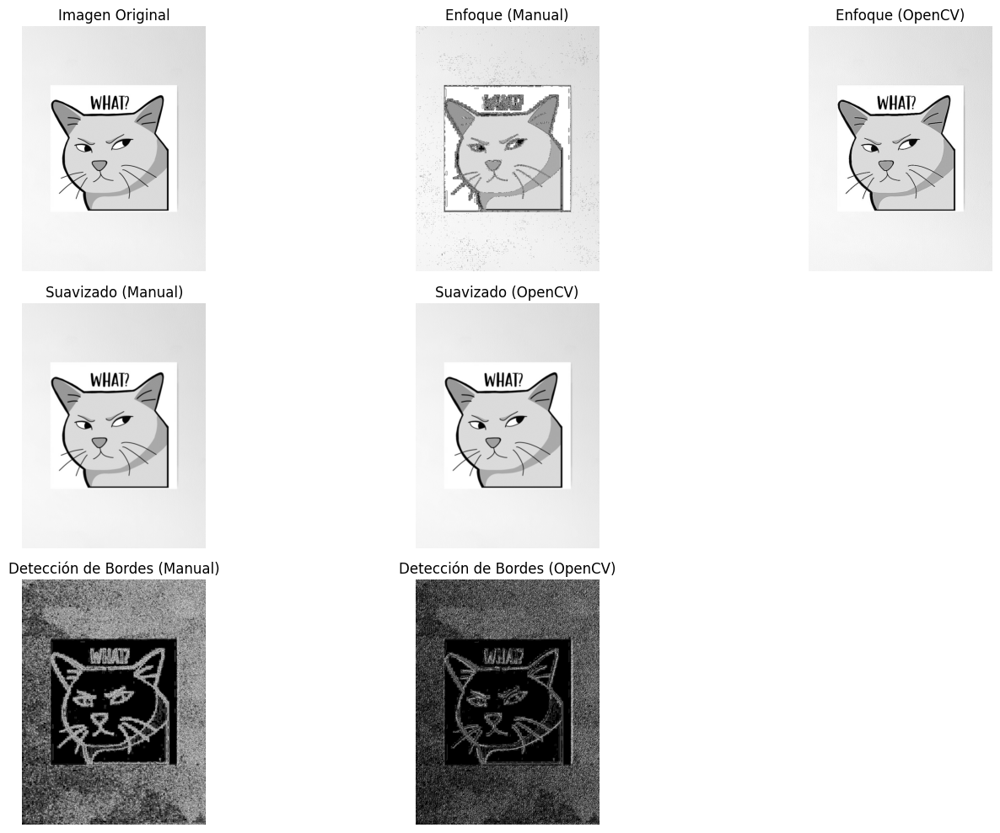

# 🧪 Taller de Convoluciones Personalizadas

## 📅 Fecha
`2025-05-03`

---

## 🎯 Objetivo del Taller

Implementar manualmente operaciones de convolución 2D y compararlas con las implementaciones de OpenCV, explorando los efectos de diferentes kernels sobre una imagen.

---

## 🧠 Conceptos Aprendidos

Lista los principales conceptos aplicados:

- [x] Transformaciones geométricas (escala, rotación, traslación)
- [x] Segmentación de imágenes
- [ ] Shaders y efectos visuales
- [ ] Entrenamiento de modelos IA
- [ ] Comunicación por gestos o voz
- [x] Otro: _Convoluciones y filtros de imágenes_

---

## 🔧 Herramientas y Entornos

Especifica los entornos usados:

- Python (`opencv-python`, `numpy`, `matplotlib`)

---

## 🧪 Implementación

Explica el proceso:

### 🔹 Etapas realizadas
1. Preparación de la imagen convirtiéndola a escala de grises.
2. Implementación de una función de convolución manual desde cero.
3. Diseño de tres kernels diferentes para procesamiento de imágenes.
4. Aplicación de los kernels usando tanto la implementación manual como OpenCV.
5. Visualización de los resultados para comparación.
6. Cálculo de las diferencias numéricas entre ambas implementaciones.

### 🔹 Código relevante

Implementación de convolución manual:

```python
# Función para aplicar convolución 2D manualmente
def convolucion_manual(imagen, kernel):
    # Obtener dimensiones
    alto_img, ancho_img = imagen.shape
    alto_k, ancho_k = kernel.shape
    
    # Calcular padding
    pad_y = alto_k // 2
    pad_x = ancho_k // 2
    
    # Crear imagen con padding
    imagen_pad = np.pad(imagen, ((pad_y, pad_y), (pad_x, pad_x)), mode='reflect')
    
    # Crear imagen de salida
    salida = np.zeros_like(imagen)
    
    # Aplicar convolución
    for y in range(alto_img):
        for x in range(ancho_img):
            # Extraer región de interés
            roi = imagen_pad[y:y+alto_k, x:x+ancho_k]
            # Aplicar kernel y sumar
            salida[y, x] = np.sum(roi * kernel)
    
    return salida

# Definir kernels
# Kernel de enfoque (sharpening)
kernel_enfoque = np.array([
    [0, -1, 0],
    [-1, 5, -1],
    [0, -1, 0]
])

# Kernel de suavizado (blur)
kernel_suavizado = np.array([
    [1/9, 1/9, 1/9],
    [1/9, 1/9, 1/9],
    [1/9, 1/9, 1/9]
])

# Kernel de detección de bordes (Sobel horizontal + vertical)
kernel_sobel_x = np.array([
    [-1, 0, 1],
    [-2, 0, 2],
    [-1, 0, 1]
])

kernel_sobel_y = np.array([
    [-1, -2, -1],
    [0, 0, 0],
    [1, 2, 1]
])
```

---

## 📊 Resultados Visuales

### Imagen original



### Kernels aplicados



> Diferencia media en enfoque: 10.0427 \
Diferencia media en suavizado: 0.3825 \
Diferencia media en detección de bordes: 2.4217

---

## 🧩 Prompts Usados

```text
"Escribe un código en python con las herramientas: opencv-python, numpy, matplotlib, que haga lo siguiente:

- Cargar una imagen en escala de grises. (Convertir a escala de grises si la imagen cargada está a color).
- Implementar manualmente una convolución 2D desde cero con NumPy:
    * Definir una función que aplique un kernel personalizado a cada píxel.
- Diseñar y aplicar al menos 3 kernels distintos:
    * Enfocar (sharpening)
    * Suavizado (blur)
    * Detección de esquinas o bordes (esquinas = Sobel + derivadas cruzadas)
- Comparar visualmente los resultados con los obtenidos usando funciones de OpenCV como cv2.filter2D().
- Mostrar las imágenes resultantes en paralelo para análisis."
```

---

## 💬 Reflexión Final

En este taller, aprendí a implementar operaciones fundamentales de procesamiento de imágenes, específicamente convoluciones 2D, desde cero utilizando NumPy. La convolución es una operación fundamental en el procesamiento de imágenes y entender su funcionamiento interno ha sido revelador.

La parte más interesante fue observar cómo los diferentes kernels transforman la imagen original de maneras distintas y cómo pequeñas variaciones en los valores del kernel pueden producir efectos dramáticamente diferentes.
