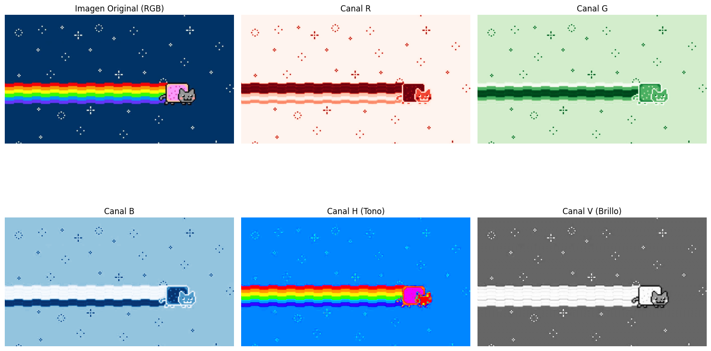
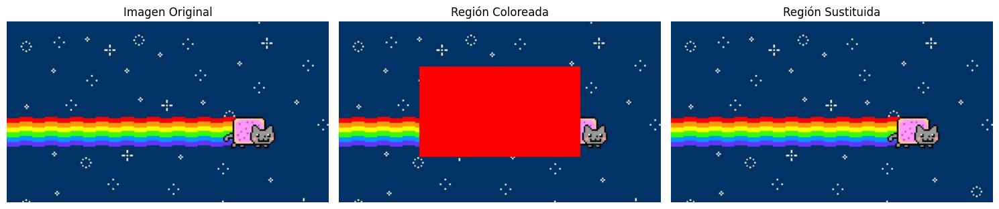
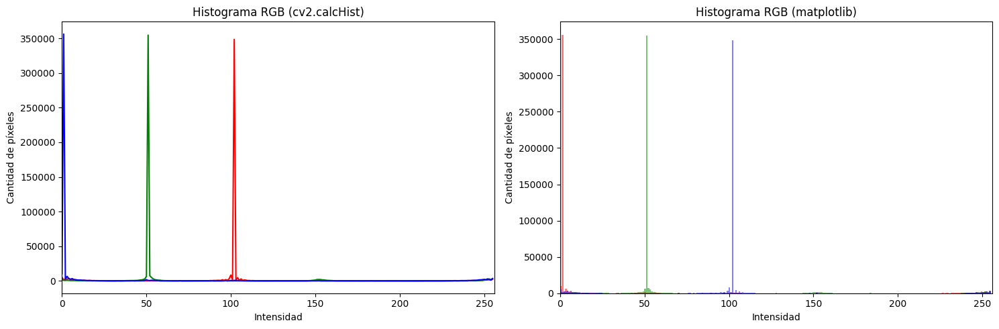
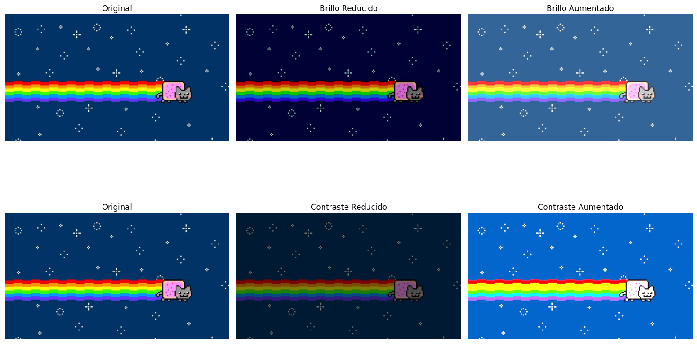

# 🧪 Taller de Imagen: Matriz de Píxeles

## 📅 Fecha
`2025-05-03`

---

## 🎯 Objetivo del Taller

Este taller explora los fundamentos del procesamiento de imágenes a nivel de matriz de píxeles. El objetivo es comprender cómo las imágenes digitales son representadas como matrices numéricas y cómo se pueden manipular estos valores para crear efectos y transformaciones.

---

## 🧠 Conceptos Aprendidos

Los principales conceptos aplicados:

- [x] Transformaciones geométricas (escala, rotación, traslación)
- [x] Segmentación de imágenes
- [ ] Shaders y efectos visuales
- [ ] Entrenamiento de modelos IA
- [ ] Comunicación por gestos o voz
- [x] Otro: _Manipulación directa de matrices de píxeles_

---

## 🔧 Herramientas y Entornos

Entornos utilizados:

- Python (`opencv-python`, `numpy`, `matplotlib`)

---

## 🧪 Implementación

Explica el proceso:

### 🔹 Etapas realizadas
1. Carga de una imagen digital en formato RGB.
2. Exploración de la estructura matricial de la imagen.
3. Aplicación de transformaciones básicas (escala de grises, inversión).
4. Manipulación de canales RGB individuales.
5. Implementación de filtros mediante operaciones matriciales.

### 🔹 Código relevante

```python
# Transformación de imagen a escala de grises
def to_grayscale(image):
    # Promedio ponderado de canales RGB
    return np.dot(image[...,:3], [0.299, 0.587, 0.114])
    
# Aplicación de filtro por convolución
def apply_kernel(image, kernel):
    # Aplicar convolución a la imagen utilizando un kernel
    return cv2.filter2D(image, -1, kernel)

# Método manual
def ajustar_brillo_contraste_manual(imagen, alfa, beta):
    # alfa: contraste (1.0-3.0)
    # beta: brillo (0-100)
    return np.clip(alfa * imagen + beta, 0, 255).astype(np.uint8)

# Método con OpenCV
def ajustar_brillo_contraste_opencv(imagen, alfa, beta):
    return cv2.convertScaleAbs(imagen, alpha=alfa, beta=beta)

# Aplicar ajustes
brillo_bajo = ajustar_brillo_contraste_manual(imagen_rgb, 1.0, -50)
brillo_alto = ajustar_brillo_contraste_manual(imagen_rgb, 1.0, 50)

contraste_bajo = ajustar_brillo_contraste_opencv(imagen_rgb, 0.5, 0)
contraste_alto = ajustar_brillo_contraste_opencv(imagen_rgb, 2.0, 0)
```

---

## 📊 Resultados Visuales







---

## 🧩 Prompts Usados

```
Crea en python un programa con las herramientas: opencv-python, numpy, matplotlib que haga lo siguiente:

- Cargar una imagen en escala de grises.
- Realizar segmentación binaria aplicando:
    * Umbral fijo (cv2.threshold).
    * Umbral adaptativo (cv2.adaptiveThreshold).
- Detectar contornos con cv2.findContours().
- Dibujar los contornos sobre la imagen original.
- Calcular y visualizar:

    * Centro de masa de cada forma detectada (cv2.moments()).
    * Bounding boxes (cv2.boundingRect()).
- Mostrar métricas básicas: número de formas detectadas, área promedio, perímetro promedio.
```

---

## 💬 Reflexión Final

Este taller permitió comprender a nivel fundamental cómo funcionan las imágenes digitales. Al trabajar directamente con las matrices de píxeles, pude observar cómo cada valor numérico representa información de color y cómo las operaciones matemáticas sencillas pueden generar transformaciones visuales significativas.

---
