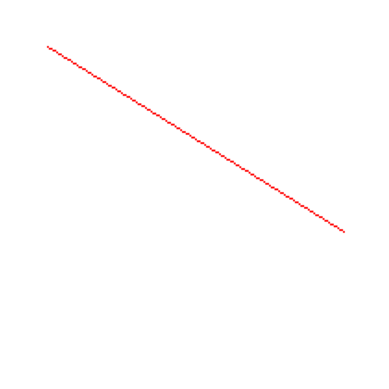
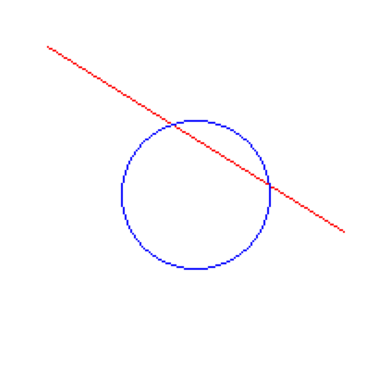
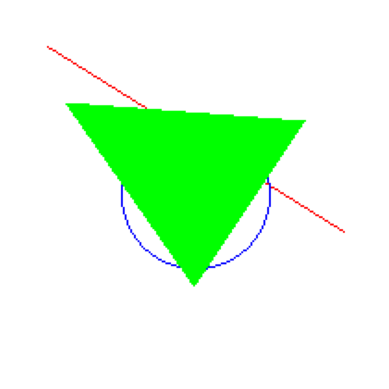

# 🧪 Algoritmos de Rasterización Básica

## 📅 Fecha
`2025-05-03`

---

## 🎯 Objetivo del Taller

Implementar algoritmos fundamentales de rasterización para la generación de primitivas gráficas básicas (líneas, círculos y polígonos) y comprender su funcionamiento matemático y computacional en la creación de imágenes digitales.

---

## 🧠 Conceptos Aprendidos

Lista de conceptos aplicados:

- [x] Transformaciones geométricas (escala, rotación, traslación)
- [ ] Segmentación de imágenes
- [ ] Shaders y efectos visuales
- [ ] Entrenamiento de modelos IA
- [ ] Comunicación por gestos o voz
- [x] Otro: Algoritmos de rasterización (Bresenham, DDA, Mid-point)

---

## 🔧 Herramientas y Entornos

- Python (`numpy`, `matplotlib`, `pillow`)

---

## 🧪 Implementación

### 🔹 Etapas realizadas
1. Implementación del algoritmo de Bresenham para líneas.
2. Desarrollo del algoritmo de círculos con punto medio.
3. Combinación de primitivas para crear polígonos y formas compuestas.
4. Generación de animaciones para visualizar los algoritmos en funcionamiento.

### 🔹 Código relevante

```python
def bresenham_line(x0, y0, x1, y1):
    """Implementación del algoritmo de Bresenham para líneas."""
    puntos = []
    dx = abs(x1 - x0)
    dy = abs(y1 - y0)
    sx = 1 if x0 < x1 else -1
    sy = 1 if y0 < y1 else -1
    err = dx - dy
    
    while x0 != x1 or y0 != y1:
        puntos.append((x0, y0))
        e2 = 2 * err
        if e2 > -dy:
            err -= dy
            x0 += sx
        if e2 < dx:
            err += dx
            y0 += sy
            
    puntos.append((x1, y1))
    return puntos


def midpoint_circle(x0, y0, radius):
    x = radius
    y = 0
    p = 1 - radius

    while x >= y:
        for dx, dy in [(x, y), (y, x), (-x, y), (-y, x), (-x, -y), (-y, -x), (x, -y), (y, -x)]:
            if 0 <= x0 + dx < width and 0 <= y0 + dy < height:
                pixels[x0 + dx, y0 + dy] = (0, 0, 255)
        y += 1
        if p <= 0:
            p = p + 2*y + 1
        else:
            x -= 1
            p = p + 2*y - 2*x + 1

def fill_triangle(p1, p2, p3):
    # ordenar por y
    pts = sorted([p1, p2, p3], key=lambda p: p[1])
    (x1, y1), (x2, y2), (x3, y3) = pts

    def interpolate(y0, y1, x0, x1):
        if y1 - y0 == 0: return []
        return [int(x0 + (x1 - x0) * (y - y0) / (y1 - y0)) for y in range(y0, y1)]

    x12 = interpolate(y1, y2, x1, x2)
    x23 = interpolate(y2, y3, x2, x3)
    x13 = interpolate(y1, y3, x1, x3)

    x_left = x12 + x23
    for y, xl, xr in zip(range(y1, y3), x13, x_left):
        for x in range(min(xl, xr), max(xl, xr)):
            if 0 <= x < width and 0 <= y < height:
                pixels[x, y] = (0, 255, 0)

```

---

## 📊 Resultados Visuales

### 📌 Este taller **requiere explícitamente un GIF animado**:

  
#### Linea


#### Circulo


#### Triangulo



## 💬 Reflexión Final

Este taller me permitió profundizar en los fundamentos matemáticos y algorítmicos que sustentan la generación de gráficos por computadora. Al implementar estos algoritmos desde cero, he logrado comprender cómo las técnicas de rasterización transforman representaciones matemáticas en píxeles discretos.

---
