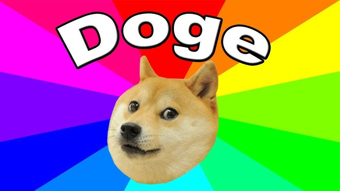
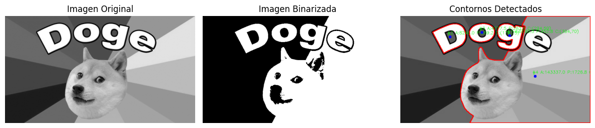

# 🧪 Taller de Análisis de Figuras Geométricas

## 📅 Fecha
`2025-05-03`

---

## 🎯 Objetivo del Taller

Desarrollar un script para detectar, segmentar y analizar formas geométricas en imágenes utilizando técnicas de visión por computadora.

---

## 🧠 Conceptos Aprendidos

Lista los principales conceptos aplicados:

- [x] Transformaciones geométricas (escala, rotación, traslación)
- [x] Segmentación de imágenes
- [ ] Shaders y efectos visuales
- [ ] Entrenamiento de modelos IA
- [ ] Comunicación por gestos o voz
- [x] Otro: _Detección y análisis de contornos en imágenes_

---

## 🔧 Herramientas y Entornos

Especifica los entornos usados:

- Python (`opencv-python`, `numpy`, `matplotlib`)

---

## 🧪 Implementación

Explica el proceso:

### 🔹 Etapas realizadas
1. Carga y preparación de la imagen.
2. Binarización para separar el objeto del fondo.
3. Detección de contornos en la imagen binarizada.
4. Cálculo de propiedades geométricas (área, perímetro, centroides).
5. Visualización de los resultados con etiquetas.

### 🔹 Código relevante

```python
# Detectar contornos
contornos, jerarquia = cv2.findContours(imagen_bin, cv2.RETR_EXTERNAL, cv2.CHAIN_APPROX_SIMPLE)

# Procesar cada contorno
for i, contorno in enumerate(contornos):
    # Calcular propiedades
    area = cv2.contourArea(contorno)
    perimetro = cv2.arcLength(contorno, True)
    
    # Calcular centroide
    M = cv2.moments(contorno)
    if M["m00"] != 0:
        cx = int(M["m10"] / M["m00"])
        cy = int(M["m01"] / M["m00"])
    else:
        cx, cy = 0, 0
```

---

## 📊 Resultados Visuales

> Se detectaron 4 contornos en total

### Imagen original


### Imagen procesada



---

## 🧩 Prompts Usados

```text
Escribe un código en python con las herramientas: opencv-python, numpy, matplotlib que haga lo siguiente:

- Cargar una imagen binarizada (puede provenir de talleres anteriores o generarse con cv2.threshold()).
- Detectar contornos usando cv2.findContours().
- Calcular las siguientes propiedades para cada contorno:
    * Área con cv2.contourArea().
    * Perímetro con cv2.arcLength().
    * Centroide a partir de los momentos (cv2.moments()).
- Dibujar cada contorno sobre una copia de la imagen original.
- Etiquetar cada figura con sus métricas: área, perímetro y coordenadas del centroide.
```

---

## 💬 Reflexión Final

El taller permitió aplicar conceptos de visión por computadora para analizar figuras geométricas en imágenes. La parte más interesante fue adaptar los algoritmos para funcionar correctamente con una imagen compleja, que presenta variaciones de color y formas no convencionales.
