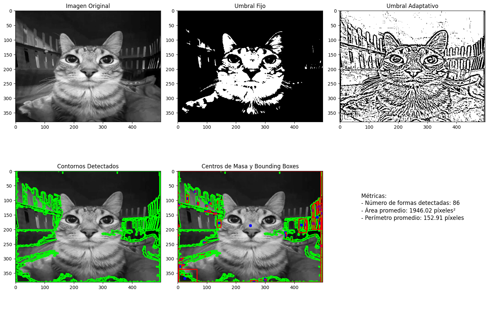

# 🧪 Taller de Segmentación de Formas

## 📅 Fecha
`2025-05-03`

---

## 🎯 Objetivo del Taller

Implementar y explorar técnicas de segmentación de imágenes para detectar y extraer formas específicas, aplicando algoritmos de visión por computadora para el procesamiento y análisis de imágenes.

---

## 🧠 Conceptos Aprendidos

Lista los principales conceptos aplicados:

- [x] Segmentación de imágenes
- [x] Transformaciones geométricas (escala, rotación, traslación)
- [ ] Shaders y efectos visuales
- [ ] Entrenamiento de modelos IA
- [ ] Comunicación por gestos o voz
- [x] Otro: _Procesamiento morfológico y detección de contornos_

---

## 🔧 Herramientas y Entornos

Especifica los entornos usados:

- Python (`opencv-python`, `numpy`, `matplotlib`)

📌 Usa las herramientas según la [guía de instalación oficial](./guia_instalacion_entornos_visual.md)

---

## 🧪 Implementación

Explica el proceso:

### 🔹 Etapas realizadas
1. Preparación de imágenes y aplicación de filtros para mejorar contraste.
2. Segmentación mediante umbrales adaptativos y operaciones morfológicas.
3. Detección y extracción de contornos de formas.
4. Análisis y clasificación de las formas detectadas.
5. Visualización de resultados con anotaciones en tiempo real.

### 🔹 Código relevante

Incluye un fragmento que resuma el corazón del taller:

```python
# Segmentación de formas usando OpenCV
gray = cv2.cvtColor(image, cv2.COLOR_BGR2GRAY)
blur = cv2.GaussianBlur(gray, (5, 5), 0)
_, thresh = cv2.threshold(blur, 0, 255, cv2.THRESH_BINARY_INV + cv2.THRESH_OTSU)

# Operaciones morfológicas para mejorar la segmentación
kernel = cv2.getStructuringElement(cv2.MORPH_RECT, (3, 3))
opening = cv2.morphologyEx(thresh, cv2.MORPH_OPEN, kernel, iterations=2)

# Encontrar contornos de las formas
contours, _ = cv2.findContours(opening, cv2.RETR_EXTERNAL, cv2.CHAIN_APPROX_SIMPLE)
```

---

## 📊 Resultados Visuales




---

## 🧩 Prompts Usados

Enumera los prompts utilizados:

```text
Crea en python un programa con las herramientas: opencv-python, numpy, matplotlib que haga lo siguiente:

- Cargar una imagen en escala de grises.
- Realizar segmentación binaria aplicando:
    * Umbral fijo (cv2.threshold).
    * Umbral adaptativo (cv2.adaptiveThreshold).
- Detectar contornos con cv2.findContours().
- Dibujar los contornos sobre la imagen original.
- Calcular y visualizar:
    * Centro de masa de cada forma detectada (cv2.moments()).
    * Bounding boxes (cv2.boundingRect()).
- Mostrar métricas básicas: número de formas detectadas, área promedio, perímetro promedio.
```
---

## 💬 Reflexión Final

La implementación de técnicas de segmentación de imágenes me permitió comprender profundamente cómo los algoritmos de visión por computadora pueden identificar y extraer información significativa de una imagen. El manejo de umbrales adaptativos y operaciones morfológicas resultó crucial para obtener segmentaciones precisas en distintas condiciones de iluminación.

---
