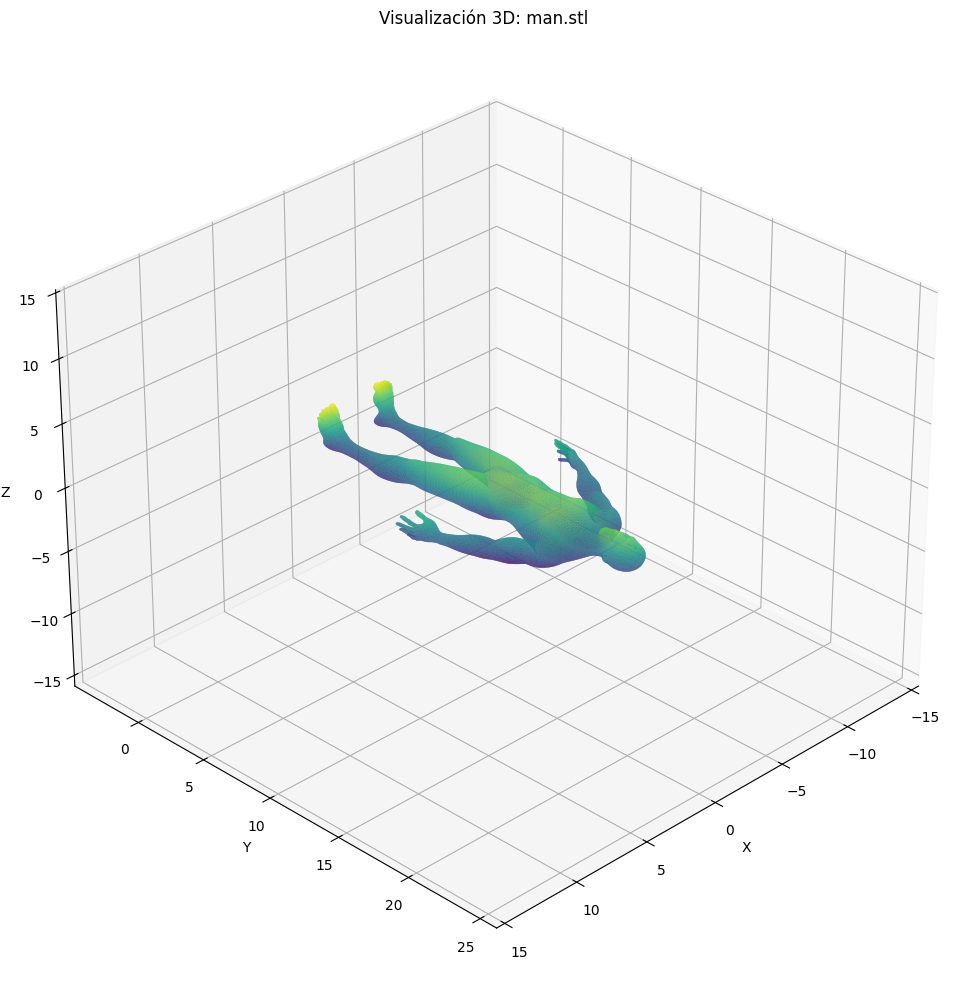

# 🧪 Proyecto de Conversión y Visualización de Formatos 3D

## 📅 Fecha `2025-05-07`

## 🎯 Objetivo del Proyecto

Explorar y aplicar técnicas de conversión y visualización entre diferentes formatos de archivos 3D (.OBJ, .STL, .GLTF) a través de dos enfoques complementarios:

1. **Backend con Python**: Conversión entre formatos usando trimesh y análisis comparativo de propiedades geométricas
2. **Frontend con Three.js**: Visor web interactivo que carga y visualiza modelos 3D en diferentes formatos

El objetivo global es comprender las diferencias entre formatos 3D, sus particularidades técnicas y su manipulación tanto en entornos de procesamiento como en aplicaciones web.

---

## 🧠 Conceptos Aprendidos

- [x] Transformaciones geométricas (escala, rotación, traslación)
- [ ] Segmentación de imágenes
- [x] Shaders y efectos visuales (renderizado básico con Three.js)
- [ ] Entrenamiento de modelos IA
- [ ] Comunicación por gestos o voz
- [x] Otro: Procesamiento de mallas 3D y análisis geométrico
- [x] Otro: Conversión y visualización entre formatos 3D

---

## 🔧 Herramientas y Entornos

### 📌 Backend (Python)
- Python (`trimesh`, `matplotlib`, `numpy`)
- Jupyter

### 📌 Frontend (Web)
- React (v18)
- Three.js
- Loaders para formatos 3D: OBJLoader, STLLoader, GLTFLoader
- Vite (para el entorno de desarrollo)

📌 Usa las herramientas según la [guía de instalación oficial](./guia_instalacion_entornos_visual.md)

---

## 🧪 Implementación

### 📌 Componente Python

#### 🔹 Etapas realizadas
1. Desarrollo del script de conversión entre formatos 3D
2. Implementación de la visualización interactiva
3. Análisis comparativo de propiedades geométricas
4. Generación de reportes visuales

#### 🔹 Código relevante

```python
# Conversión de formatos
def convertir_y_guardar(mesh, ruta_original, formato_destino):
    if mesh is None:
        return False
    
    try:
        # Crear directorio de salida si no existe
        directorio_base = os.path.dirname(ruta_original)
        nombre_archivo = os.path.splitext(os.path.basename(ruta_original))[0]
        ruta_destino = os.path.join(directorio_base, f"{nombre_archivo}.{formato_destino}")
        
        # Guardar en el formato especificado
        if formato_destino == "stl":
            trimesh.exchange.stl.export_stl(mesh)
        elif formato_destino == "glft":
            trimesh.exchange.gltf.export_gltf(mesh)
            
        print(f"Modelo guardado como {ruta_destino}")
        return True
    except Exception as e:
        print(f"Error al convertir a {formato_destino}: {e}")
        return False
```

### 📌 Componente Three.js

#### 🔹 Etapas realizadas

1. **Configuración del entorno React con Three.js**:
   - Creación del componente ModelViewer para renderizar escenas 3D
   - Implementación de OrbitControls para navegación interactiva en la escena 3D

2. **Implementación de carga de modelos**:
   - Desarrollo del componente ModelSelect para manejar la selección entre formatos
   - Configuración de loaders específicos para cada formato (OBJ, STL, GLTF)
   - Implementación de estrategias de rutas alternativas para mejorar la fiabilidad

3. **Análisis de modelos y extracción de información**:
   - Recorrido de geometría de los modelos para extraer datos técnicos
   - Cálculo de vértices, aristas, caras y otras propiedades de los modelos
   - Visualización de información en formato tabular

4. **Optimización de la experiencia de usuario**:
   - Preservación de posición de cámara entre cambios de modelo
   - Manejo de errores de carga
   - Indicadores visuales de carga y estados de error

#### 🔹 Código relevante

```jsx
// Carga de modelos según formato (ModelSelect.jsx)
switch (format) {
  case 'obj':
    loader = new OBJLoader();
    model = await loader.loadAsync(path);
    break;
    
  case 'stl':
    loader = new STLLoader();
    const geometry = await loader.loadAsync(path);
    const material = new THREE.MeshStandardMaterial({ 
      color: 0x7a7a7a,
      flatShading: true
    });
    model = new THREE.Mesh(geometry, material);
    break;
    
  case 'gltf':
    loader = new GLTFLoader();
    const gltf = await loader.loadAsync(path);
    model = gltf.scene;
    break;
}

// Análisis de modelo (Extracción de información)
model.traverse((object) => {
  if (object.isMesh) {
    const geometry = object.geometry;
    if (geometry.isBufferGeometry) {
      // Contar vértices
      if (geometry.attributes.position) {
        vertices += geometry.attributes.position.count;
      }
      
      // Contar caras/triángulos
      if (geometry.index) {
        triangles += geometry.index.count / 3;
      }
    }
  }
});
```

---

## 📊 Resultados Visuales

### 📌 Visualización en Python (trimesh):





```text
--- COMPARATIVA DE PROPIEDADES DE MODELOS 3D ---

Archivo  | Vértices | Caras | Normales | Duplicados | Volumen | Área  
----------------------------------------------------------------------
man.obj  | 24461    | 48918 | 48918    | True       | 120.08  | 267.18
man.stl  | 24461    | 48918 | 48918    | True       | 120.08  | 267.18
man.gltf | 24461    | 48918 | 48918    | True       | 120.08  | 267.18
```


### 📌 Visor Web con Three.js:


*Nota: El GIF anterior muestra el visor web cargando modelos en diferentes formatos (OBJ, STL, GLTF) y permitiendo la navegación en el espacio 3D.*

---

## 🧩 Prompts Usados

### 📌 Python (trimesh)

```text
"Escribe un código en python usando trimesh que cargue un modelo 3d en formato .OBJ, lo convierta a .STL y .GLTF y lo guarde en disco."

"Escribe un código en python usando trimesh y matplotlib que permita visualizar objetos 3D en los siguientes formatos: .OBJ, .STL y .GLTF. Los modelos deben poder ser visualizados en su totalidad, así que maneja el zoom de la camara de forma proporcional al tamaño del modelo. Se debe imprimir una tabla que compare las propiedades de los modelos (vértices, caras, normales, y si hay duplicados.)"
```

---

## 💬 Reflexión Final

Este proyecto permitió explorar en profundidad el manejo de diferentes formatos de archivos 3D y sus particularidades desde dos enfoques complementarios:

**Python con trimesh**: La implementación de la conversión entre formatos demostró la importancia de entender las diferencias estructurales entre .OBJ, .STL y .GLTF, así como sus ventajas y limitaciones en cuanto al procesamiento y análisis de datos geométricos.

**Three.js en entorno web**: El desarrollo del visor interactivo permitió comprender cómo cada formato maneja diferentes aspectos como geometría, materiales y texturas, y cómo estos se comportan en aplicaciones web en tiempo real.

La combinación de ambos enfoques proporcionó una visión integral del proceso de manipulación de formatos 3D, desde su procesamiento y conversión hasta su visualización y análisis, evidenciando las fortalezas y debilidades de cada formato en distintos contextos de aplicación.
